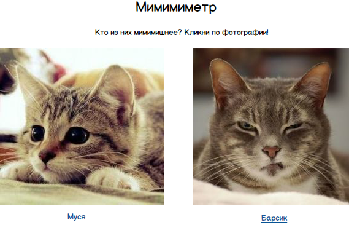
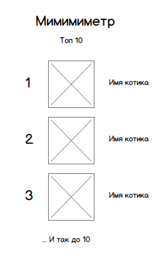

# Тестовое задание "Мимимиметр"
В фильме "Социальная сеть" есть такой эпизод: молодой Марк Цукенберг написал приложение, в котором можно было проголосовать за одну из двух предложенных студенток колледжа, кликнув по её фотографии. После первого выбора показывалась следующая пара девчонок. И так, пока не закончатся все пары. Пары подбираются случайно, но ни одна студентка не повторяется дважды. Когда пары закончатся пользователю показывается топ студенток, собранный из голосов всех пользователей.

Мы предлагаем написать похожее приложение, где вместо студенток нужно будет оценивать котов.

## Требования

Это должно быть java web приложение. Оно должно собираться с помощью Maven или Gradle. Файл сборки может быть war (для разворачивания в Tomcat) или jar (встроенный сервер). Использование web и других фреймворков по желанию. Использование БД для хранения кандидатов и результатов голосования приветствуется, но если для вас это сложно, можете хранить всё в памяти.

Страница с голосованием должна выглядеть примерно так:

- У каждого котика должно быть имя
- Каждый котик может быть предложен для голосования только один раз
- Пары должны подбираться случайно для каждого пользователя
- Должно быть не меньше 5 пар (10 котиков)
- Проголосовать можно кликнув по имени или по фотографии
- Когда все пары закончатся, нужно показать топ 10 котиков
- Топ формируется из суммы голосов всех пользователей

Страница топ10 должна выглядеть примерно так:

Кому не нравятся котики, можно использовать пёсиков. :)

## Критерии оценки

Оцениваться будет всё: codestyle, архитектура, гибкость, тестируемость, производительность.
Можете добавить функциональность, например, защиту от повторного голосования, загрузку своего списка кандидатов и т.п.

Готовые решения отправляйте на email resume@i-novus.ru.
