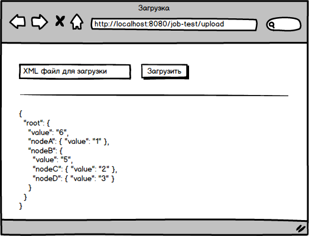

### Тестовое задание

Разработать web-приложение, позволяющее загружать данные в формате xml и выводить в заданном формате.

### Общие требования

1. Приложение должно быть реализовано на Java 8 или выше с использованием [Java Servlet API](https://docs.oracle.com/javaee/7/tutorial/servlets.htm). 
Допускается использование любого фреймворка/платформы/библиотеки работающего поверх Java Servlet API.
1. Приложение должно запускаться на сервере приложений [Tomcat](https://tomcat.apache.org/) 8 или выше.
1. Если в ходе обработки запроса в приложении произошла ошибка, то информация об ошибке должна быть сохранена в файл в стандартной папке журналов сервера 
приложений и на странице выводится сообщение "Произошла непредвиденная ошибка".
Для записи в файл сообщений от приложения использовать библиотеку [slf4j](http://www.slf4j.org/).
1. Для описания сборки приложения использовать любую из современных систем 
автоматической сборки: [gradle](https://gradle.org/), [maven](https://maven.apache.org/) и др.
1. Выполненное задание необходимо отправить письмом на email resume@i-novus.ru.
1. Ориентировочный срок выполнения - 5 дней.

### Web-формы

Приложение должно содержать 2 формы:

1. форму, через которую можно загрузить файл на сервер,
1. форму, где можно увидеть результат загрузки.

Допускается обе формы разместить на одной странице.

Пример того, как может выглядеть страница:



### Параметры загружаемых файлов

1. Валидный файл формата xml.
1. Размер до 10Гб.
1. Значения узлов в xml строковые, но могут содержать числа как подстроку. Числа могут быть как дробные, так и целые.

**Допускается вводить свои дополнительные ограничения на входящие файлы, если не получается сделать универсальный вариант.**
Конечно, чем меньше ограничений будет добавлено, тем лучше. В идеале - не добавлять совсем.

### Формат вывода

Нужно вывести загруженный xml в виде дерева в формате json. Иерархию узлов исходного xml нужно сохранить и перенести в json.
В каждый узел иерархии добавить элемент `"value"`, значение которого должно быть равно сумме всех чисел которые встретились в этом узле и во всех его дочерних узлах.
Если в узле нет дочерних элементов, то элемент `"value"` заменяет исходное значение узла.

### Пример
На входе:
```xml
<root>
 <nodeA>Node 1</nodeA>
 <nodeB>
  <nodeC>Node 2</nodeC>
  <nodeD>Node 3</nodeD>
 </nodeB>
</root>
```

На выходе:
```json
{
  "root": {
    "value": "6",
    "nodeA": { "value": "1" },
    "nodeB": {
      "value": "5",
      "nodeC": { "value": "2" },
      "nodeD": { "value": "3" }
    }
  }
}
```

### Критерии оценки
Оцениваться будет всё, начная от codestyle, заканчивая скоростью работы приложения и выбранным способом решения. Например, плюсом будет наличие юнит-тестов.
Приветствуются свои оригинальные решения, не приветствуется копипаста с чужих готовых проектов.
